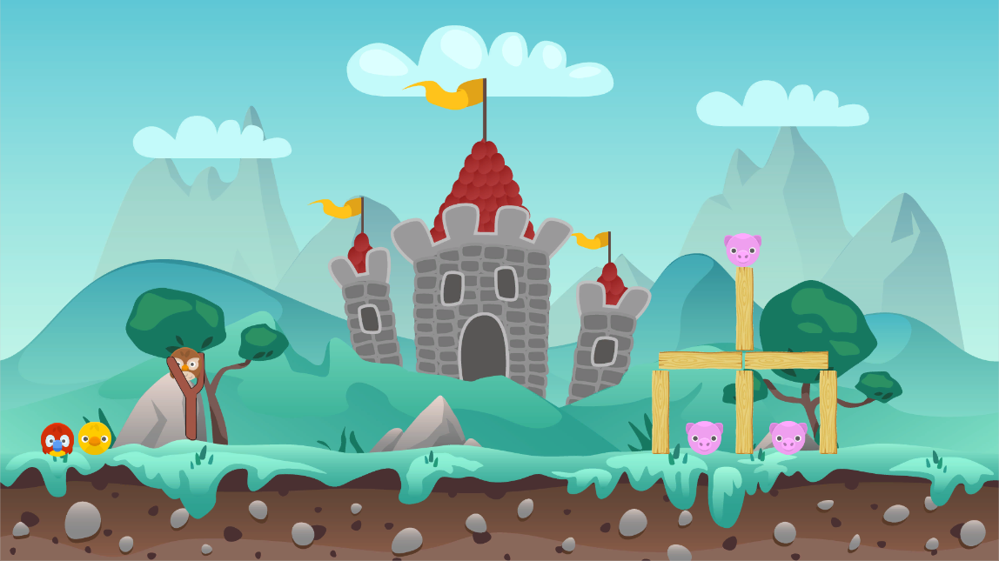

# Angeri Birb

This is an Angry Birds clone and currently is one level long. The obstacles are apparently immortal, they cannot break.

This game is made as a study in game development, presented by Agate Academy.

## How To Run

There is no need to install the game. The build version of the game is in the build folder. All you have to do is just run the .exe file, setup your prefered resolution size, and the game runs right away it. Windowed mode is recommended to close the game easily since there's no exit button in the game.

## Features & Keybinds

- This is a single player game.
- The rules are simple, kill all the pigs before you run out of birbs.
- Controls:
  - Charge up your birb on the catapult by clicking and holding
  - Release it to launch the birb
- There are currently 3 types of birbs
  - Red Birb: No special abilities
  - Yellow Birb: Tap the bird after throwing it to give a speed boost
  - Owl Birb: Grows 2x its size after contact with anything

## Contributor

- Gregorius Jovan Kresnadi | 13518135
